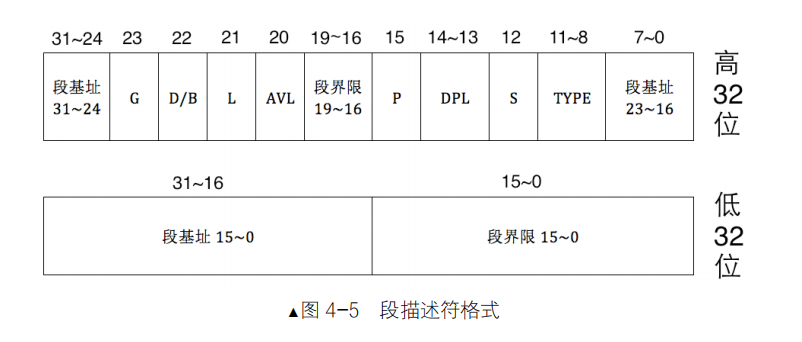
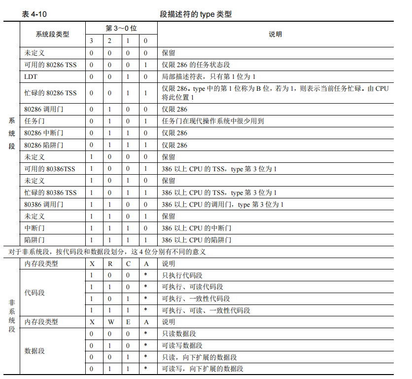
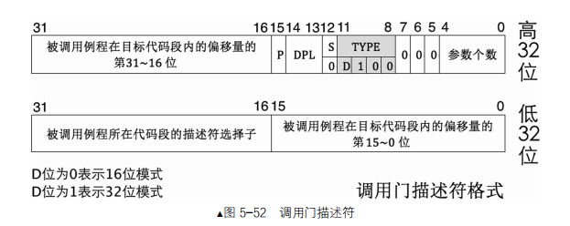

## 保护模式
1. 可读：放在原操作数。可写：放在目标操作数。可执行：可以复制EIP
2. 进入保护模式
    - 打开A20
    - 加载gdt
    - 将cr0的pe位 置1

### 全局段描述符表

1. GDT（全局描述符表） LDT（局部描述符表）
2. `r gdtr` gdtr==>全局描述符表寄存器；`r gdtl` gdtl==>全局描述符表长度  
    

3. P位。P=1存在内存中；否则P=0；
4. G位。G位为0，表示段界限粒度大小为1字节；G位为1，表示段界限粒度大小为4KB字节。
5. S位。S位为0，表示系统段描述符；S位为1，表示代码段或者数据段描述符。  
    

6. Type位。
    - S位为1.
    - A访问位 
    - C=1一致位，C=0非一致代码段
    - R可读位 。如果不可读，使用超越前缀CS来访问代码段，CPU将抛出异常。
    - X位是否可执行。1表示代码段可执行，0表示数据段不可执行
    - E=1向下扩展,E=0向上扩展
    - W位指段是否可写
7. DB位。D=1采用32位寻址方式；D=0采用16位寻址方式。
8. L位。用来设置是否是64位代码段。
9. LGTR , `lgdt48 `

### 段寄存器
1. ES,CS,DS,SS
2. FS,GS

    属性 | 位数 | 对应
    ---| --- | --- 
    selector | 16位 | 
    atrribute | 16位 | 段描述符 高字节 8-23位
    base | 32位 | 高字节 24-31位+ 高字节 0-7位 + 低字节 16-31位
    limit | 32位 | 高字节 16-19位+低字节 0-15位. (描述符中段界限+1)*（段界限的粒度：4KB或者1）-1

### A20线

### 数据段权限
1. CPU分级：ring 0，ring 1,ring 2,ring 3
2. cs段选择子存储的是 当前权限 （CPL）
3. CPL<=DPL,且RPL<=DPL (数值上)

### 代码跨段
1. JMP 
    - 段选择子拆分
    - 查表得到段描述符 （代码段，调用门，TSS任务段，任务门） 
    - 权限检查 （非一致代码段，要求：CPL==DPL，且 RPL<=DPL。一致代码段，要求CPL>=DPL）
    > 一致代码段就是系统用来共享、提供给低特权级的程序使用调用的代码。  
    > 非一致代码段：为了避免被低特权级程序访问而被系统保护起来的代码。（使用“门”）
    - 加载描述符
    - 执行代码

### 调用门
> CALL CS:EIP
1. 根据CS的值查GDT表，找到对应段描述符，这个描述符就是一个调用门
    - S位为0;Type位为1100
2. 在调用门描述符中存储另一个代码段的段选择子
3. 选择子指向段的。段.base+偏移地址，就是真正要执行的地址。  

### 中断门

### 陷阱门

### 任务门 

