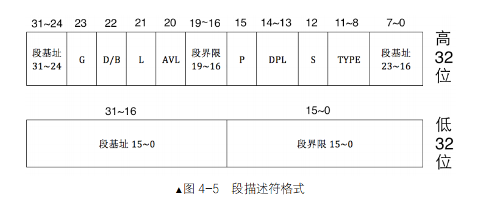

## 保护模式
1. 可读：放在原操作数。可写：放在目标操作数。可执行：可以复制EIP

### 段寄存器
1. ES,CS,DS,SS,FS,GS,TR,LDTR.

| selector |  16位 |
| atrribute |  16位 |
| base |  32位 |
| limit | 32位 |

### 段描述符
1. GDT（全局描述符表） LDT（局部描述符表）
2. `r gdtr` gdtr==>全局描述符表寄存器；`r gdtl` gdtl==>全局描述符表长度.

### 调用门

### 中断门

### 陷阱门

### 任务门 

### 分页

### 中断异常

