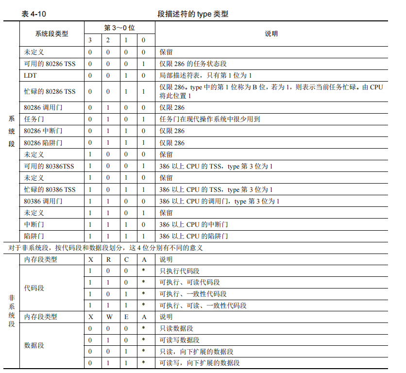

## 保护模式
1. 可读：放在原操作数。可写：放在目标操作数。可执行：可以复制EIP

### 段寄存器
1. ES,CS,DS,SS,FS,GS,TR,LDTR  

    属性 | 位数 | 对应
    ---| --- | --- 
    selector | 16位 | 
    atrribute | 16位 | 段描述符 高字节 8-23位
    base | 32位 | 高字节 24-31位+ 高字节 0-7位 + 低字节 16-31位
    limit | 32位 | 高字节 16-19位+低字节 0-15位. (描述符中段界限+1)*（段界限的粒度：4KB或者1）-1

### 段描述符
1. GDT（全局描述符表） LDT（局部描述符表）
2. `r gdtr` gdtr==>全局描述符表寄存器；`r gdtl` gdtl==>全局描述符表长度  
    

3. P位。P=1存在内存中；否则P=0；
4. G位。G位为0，表示段界限粒度大小为1字节；G位为1，表示段界限粒度大小为4KB字节。
5. S位。S位为0，表示系统段描述符；S位为1，表示代码段或者数据段描述符。
    

### 调用门

### 中断门

### 陷阱门

### 任务门 

### 分页

### 中断异常

